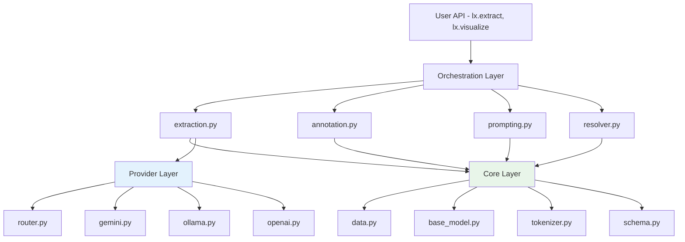

# 아키텍처, 모듈 구조, 설계 패턴

## 모듈 구조

```
langextract/
├── __init__.py              # PEP 562 lazy loading. extract(), visualize()만 eager
├── extraction.py ★          # 진입점. 전체 파이프라인 오케스트레이션
├── annotation.py ★          # 청크별 LLM 추론 루프, 다중 패스 병합
├── resolver.py ★            # LLM 출력 파싱 + Source Grounding (WordAligner)
├── chunking.py              # 텍스트→TextChunk 분할
├── prompting.py             # 프롬프트 템플릿, ContextAwarePromptBuilder
├── prompt_validation.py     # Few-shot example 사전 검증
├── factory.py               # Provider 생성 팩토리
├── visualization.py         # Interactive HTML 생성
│
├── core/                    # 기반 계층 (상위 모듈 import 금지)
│   ├── base_model.py        # BaseLanguageModel ABC
│   ├── data.py              # Extraction, AnnotatedDocument, ExampleData
│   ├── tokenizer.py         # TokenizedText, RegexTokenizer, UnicodeTokenizer
│   ├── schema.py            # BaseSchema ABC
│   ├── format_handler.py    # JSON/YAML 파싱, 펜스 제거
│   └── exceptions.py        # 예외 계층 (LangExtractError → 5개 하위)
│
└── providers/               # LLM 제공자 (core import 금지)
    ├── __init__.py           # load_builtins_once(), load_plugins_once()
    ├── router.py ★           # Registry + 패턴 기반 라우팅
    ├── gemini.py             # 기본 제공자 (controlled generation)
    ├── ollama.py             # 로컬 모델 지원
    ├── openai.py             # 선택적 설치
    └── schemas/
        ├── gemini.py         # Gemini용 JSON Schema 생성
        └── openai.py         # OpenAI용 Schema 변환
```

## 계층 구조와 의존성 제약



### import-linter로 강제하는 의존성 규칙 (`pyproject.toml:136-161`)

```toml
# Core는 상위 모듈을 import할 수 없음
[[tool.importlinter.contracts]]
name = "Core must not import high-level modules"
source_modules = ["langextract.core"]
forbidden_modules = ["langextract.annotation", "langextract.chunking", ...]

# Providers는 inference 모듈을 import할 수 없음
[[tool.importlinter.contracts]]
name = "Providers must not import inference"
source_modules = ["langextract.providers"]
forbidden_modules = ["langextract.inference"]
```

**의도**: 단방향 의존성 강제. 순환 참조 원천 차단. 새 provider 추가 시 core 변경 불필요.

## 설계 패턴 분석

### 1. Registry + Lazy Loading (Provider 발견)

```python
# router.py:108-135 — 패턴 기반 라우팅
@functools.lru_cache(maxsize=128)
def resolve(model_id: str) -> type[BaseLanguageModel]:
    sorted_entries = sorted(_entries, key=lambda e: e.priority, reverse=True)
    for entry in sorted_entries:
        if any(pattern.search(model_id) for pattern in entry.patterns):
            return entry.loader()  # 지연 로딩 — 실제 사용 시에만 import

# providers/__init__.py:74-142 — Entry Point 자동 발견
def load_plugins_once():
    for ep in importlib.metadata.entry_points(group="langextract.providers"):
        module = ep.load()
        # 자동 등록됨
```

**장점**:
- 컴파일 타임 의존성 없음
- 우선순위 기반 충돌 해결 (커뮤니티 플러그인이 내장 provider 오버라이드 가능)
- `pip install langextract-provider-anthropic`만으로 새 provider 사용 가능

### 2. PEP 562 Lazy Module Loading

```python
# __init__.py:63-98
_LAZY_MODULES = {
    "annotation": "langextract.annotation",
    "chunking": "langextract.chunking",
    # ...
}

def __getattr__(name: str) -> Any:
    if name in _LAZY_MODULES:
        module = importlib.import_module(_LAZY_MODULES[name])
        sys.modules[f"{__name__}.{name}"] = module  # 캐싱
        return module
```

**효과**: `import langextract` 비용 ~100ms (전체 로드 ~1s 대비). `extract()`와 `visualize()`만 eager import.

### 3. Factory + Strategy (모델 생성)

```python
# factory.py:103-177
@dataclasses.dataclass(slots=True, frozen=True)
class ModelConfig:
    model_id: str | None = None
    provider: str | None = None
    provider_kwargs: dict = field(default_factory=dict)

def create_model(config: ModelConfig, ...) -> BaseLanguageModel:
    providers.load_builtins_once()   # 지연 로드
    providers.load_plugins_once()
    provider_class = router.resolve(config.model_id)  # 패턴 매칭
    kwargs = _kwargs_with_environment_defaults(...)    # 환경변수 자동 해석
    return provider_class(**kwargs)
```

**특징**: 환경변수(GEMINI_API_KEY, OPENAI_API_KEY) 자동 해석 + 패턴 기반 provider 선택

### 4. Schema 추상화 (Provider별 차이 캡슐화)

```python
# core/schema.py:38-91
class BaseSchema(abc.ABC):
    @classmethod
    @abc.abstractmethod
    def from_examples(cls, examples_data) -> BaseSchema:
        """예제에서 스키마 자동 생성"""

    @abc.abstractmethod
    def to_provider_config(self) -> dict:
        """공급자별 설정으로 변환"""
        # Gemini: {"response_schema": {...}, "response_mime_type": "..."}
        # OpenAI: {"response_format": {...}}

    @property
    @abc.abstractmethod
    def requires_raw_output(self) -> bool:
        """펜스 출력 필요 여부"""
```

**왜 이렇게 하는가**: Gemini는 `response_schema`, OpenAI는 `response_format`, Ollama는 스키마 미지원. 3가지 메서드만 구현하면 새 provider의 스키마 처리 완료.

### 5. 포괄적 예외 계층

```
LangExtractError
├── InferenceError
│   ├── InferenceConfigError   # 설정 오류
│   ├── InferenceRuntimeError  # 실행 중 오류 (original exception 포함)
│   └── InferenceOutputError   # 출력 형식 오류
├── InvalidDocumentError       # 잘못된 입력
├── SchemaError                # 스키마 생성/적용 오류
└── FormatError
    └── FormatParseError       # JSON/YAML 파싱 실패
```

**장점**: 사용자가 `except InferenceRuntimeError`로 정확한 에러만 처리 가능. `original` 속성으로 근본 원인 추적.

## 데이터 모델

```python
# 핵심 데이터 흐름
Document(text, document_id)
  → TextChunk(document, token_interval)
    → LLM 추론
      → Extraction(
          extraction_class,     # "medication", "symptom"
          extraction_text,      # "aspirin 500mg"
          char_interval,        # CharInterval(start=42, end=56)
          alignment_status,     # MATCH_EXACT | MATCH_FUZZY | ...
          attributes,           # {"dosage": "500mg", "frequency": "daily"}
        )
        → AnnotatedDocument(text, extractions=[...])
```

**모든 Extraction에 char_interval** → 원문의 정확한 위치. 시각화에서 클릭하면 원문 하이라이트.

## 코드 품질 관리

| 도구 | 용도 |
|------|------|
| **pylint 3.x** | 정적 분석 |
| **pyink** (Google's Black fork) | 코드 포맷팅 |
| **pytype** | 정적 타입 검사 |
| **import-linter** | 의존성 규칙 강제 |
| **isort** | import 정렬 |
| **pre-commit** | 매 커밋마다 자동 검사 |

### 테스트

```
tests/ (24+ 파일)
├── resolver_test.py (83KB)           # WordAligner 상세 테스트
├── annotation_test.py (47KB)         # 파이프라인 통합
├── prompt_validation_test.py         # 예제 검증 로직
├── extract_schema_integration_test.py # End-to-end
├── test_live_api.py                  # 실제 API 호출 (marker: live_api)
└── ...
```

## 약점 및 개선 여지

| 약점 | 상세 |
|------|------|
| **Gemini 편향** | 기본 provider이자 schema 지원이 가장 풍부. OpenAI/Ollama는 기능 제한 |
| **resolver.py 크기** | 909줄 — 정렬 로직이 복잡하지만 분리 어려움 |
| **absl-py 의존** | Google 외부 개발자에게 생소 |
| **비동기 미지원** | 메인 `extract()`는 동기. 배치 API만 비동기 |

## 배울 점

- **import-linter로 의존성 규칙 강제**: 코드 리뷰에 의존하지 않고 CI에서 자동 검증. 대규모 프로젝트 필수
- **PEP 562 lazy loading**: 라이브러리 import 비용을 10분의 1로 줄이는 표준 기법
- **Entry Points 기반 플러그인**: 패키지 설치만으로 자동 등록. 커뮤니티 확장의 진입장벽 최소화
- **frozen dataclass + slots**: immutable 데이터 모델 + 메모리 효율. 안전하고 빠름
- **예외 계층 설계**: `InferenceError` → `InferenceRuntimeError(original=...)` 패턴으로 근본 원인 추적

## 적용 아이디어

- **import-linter 도입**: EDR 프로젝트에서도 모듈 간 의존성 규칙을 CI로 강제. 아키텍처 부패 방지
- **Plugin 시스템 설계**: EDR AI의 LLM 제공자를 Entry Points 기반 플러그인으로 설계. 새 LLM 추가 시 코어 변경 없음
- **예외 계층 설계**: EDR AI의 AI 분석 오류를 체계적으로 분류. `AnalysisError → PromptError | ModelError | ParseError`
- **PEP 562 적용**: EDR 프론트엔드의 Python 유틸리티에서 lazy loading으로 초기화 비용 절감
