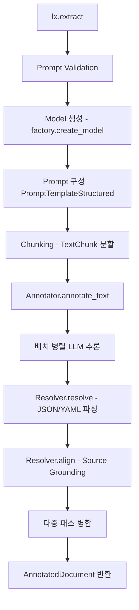

# 핵심 로직 흐름, 알고리즘/패턴

## 전체 실행 흐름



## 1. Source Grounding — WordAligner (핵심 알고리즘)

프로젝트의 가장 중요한 알고리즘. 추출된 텍스트를 원문의 정확한 위치에 매핑한다.

### 3단계 정렬 전략 (`resolver.py:485-680`)

```
Step 1: 정확 매칭 (MATCH_EXACT)
  → difflib.SequenceMatcher로 토큰 시퀀스 정확 일치
  → AlignmentStatus.MATCH_EXACT

Step 2: 퍼지 매칭 (MATCH_FUZZY)
  → Sliding window + SequenceMatcher
  → 토큰 겹침 비율 ≥ threshold (기본 0.75)
  → AlignmentStatus.MATCH_FUZZY

Step 3: 부분 매칭 (MATCH_LESSER)
  → 추출이 원문보다 긴 경우 (accept_match_lesser=True)
  → AlignmentStatus.MATCH_LESSER
```

### 퍼지 매칭의 성능 최적화 (`resolver.py:593-634`)

```python
def _fuzzy_align_extraction(self, extraction, source_tokens, ...):
    extraction_counts = collections.Counter(extraction_tokens_norm)
    min_overlap = int(len_e * fuzzy_alignment_threshold)

    for window_size in range(len_e, max_window + 1):
        for start_idx in range(len(source_tokens) - window_size + 1):
            # 핵심 최적화: Counter 교집합으로 사전 필터링
            if (extraction_counts & window_counts).total() >= min_overlap:
                # 비싼 SequenceMatcher는 유망한 window에만 실행
                matcher.set_seq1(window_tokens_norm)
                matches = sum(size for _, _, size in matcher.get_matching_blocks())
                ratio = matches / len_e
                if ratio > best_ratio:
                    best_ratio = ratio
                    best_span = (start_idx, window_size)
```

**핵심 아이디어**: Counter 교집합은 O(n)이고, SequenceMatcher는 O(n·m). 사전 필터링으로 비싼 연산 호출을 최소화.

## 2. Prompt Validation — 실행 전 품질 검증

### 검증 흐름 (`prompt_validation.py:122-259`)

```python
# extraction.py:181-192에서 호출
if prompt_validation_level is not PromptValidationLevel.OFF:
    report = validate_prompt_alignment(
        examples=examples,
        aligner=WordAligner(),
        ...
    )
    handle_alignment_report(report, level=prompt_validation_level)
```

### 검증 결과

| AlignmentStatus | 의미 | 조치 |
|----------------|------|------|
| MATCH_EXACT | 예제의 extraction이 텍스트에 정확히 존재 | OK |
| MATCH_FUZZY | 약간 다름 (e.g. "chair" vs "chairs") | 경고 |
| MATCH_LESSER | extraction이 텍스트보다 긺 | 경고 |
| None (FAILED) | 예제 텍스트에 전혀 없음 | 에러 |

**왜 중요한가**: 잘못된 few-shot example은 LLM을 잘못된 방향으로 유도. 실행 전에 문제를 잡으면 API 비용과 디버깅 시간 절약.

## 3. Schema 자동 생성 — Example-Driven

### Gemini용 스키마 생성 (`providers/schemas/gemini.py:98-173`)

```python
@classmethod
def from_examples(cls, examples_data, attribute_suffix="_attributes"):
    # Step 1: 모든 예제에서 클래스와 속성 타입 수집
    for example in examples_data:
        for extraction in example.extractions:
            category = extraction.extraction_class
            for attr_name, attr_value in extraction.attributes.items():
                extraction_categories[category][attr_name].add(type(attr_value))

    # Step 2: 타입 추론 → JSON Schema 구축
    # list in types → {"type": "array", "items": {"type": "string"}}
    # else → {"type": "string"}

    # Step 3: Gemini의 response_schema 파라미터로 전달
    # → LLM이 스키마를 벗어난 출력 불가능
```

**효과**: 파싱 실패율 ~5-10% → 거의 0%.

## 4. 다중 패스 추출 — Recall 향상

### 병합 전략 (`annotation.py:46-84`)

```python
def _merge_non_overlapping_extractions(all_extractions):
    merged = list(all_extractions[0])  # 첫 패스 결과 기본

    for pass_extractions in all_extractions[1:]:
        for extraction in pass_extractions:
            # char_interval 기반 overlap 판정
            overlaps = any(
                _extractions_overlap(extraction, existing)
                for existing in merged
                if existing.char_interval is not None
            )
            if not overlaps:
                merged.append(extraction)  # 새로운 위치만 추가

    return merged
```

**전략**: 첫 패스 우선(first-pass wins) + non-overlapping만 추가. 같은 위치의 중복 추출 방지.

**트레이드오프**: `extraction_passes=3` → 비용 3배, Recall +15-30% (도메인 의존)

## 5. 청킹과 컨텍스트 인식

### 기본 청킹 (`chunking.py`)

```python
# max_char_buffer=1000 기준
# 원본: 5000자 문서
# → Chunk 1: [0-1000자], Chunk 2: [1000-2000자], ...
# 토큰 경계에서만 분할 (word boundary 존중)
```

### 컨텍스트 인식 프롬프트 (`prompting.py:179-277`)

```python
class ContextAwarePromptBuilder(PromptBuilder):
    def build_prompt(self, chunk_text, document_id, additional_context=None):
        # 이전 청크의 끝 N자를 컨텍스트로 주입
        effective_context = self._build_effective_context(document_id, ...)
        # "이전 텍스트: ...examined the patient" → 대명사 해결 도움
        self._prev_chunk_by_doc_id[document_id] = chunk_text
```

**문제 해결**: 청크 경계에서 "She"가 누구인지 모르는 문제. 이전 청크의 꼬리를 힌트로 제공.

## 6. FormatHandler — LLM 출력 정규화

### 다양한 출력 형식 처리 (`core/format_handler.py`)

```python
_FENCE_RE = re.compile(
    r"```(?P<lang>[A-Za-z0-9_+-]?)?"
    r"(?:\s*\n)?"
    r"(?P<body>[\s\S]*?)"
    r"```",
    re.MULTILINE,
)

_THINK_TAG_RE = re.compile(r"<think>[\s\S]*?</think>\s*", re.IGNORECASE)
```

| LLM 출력 형식 | 처리 |
|--------------|------|
| ````json ... ```` | 펜스 제거 |
| `<think>...</think>` | reasoning 토큰 제거 |
| `{"extractions": [...]}` | wrapper key 추출 |
| `[{...}, {...}]` | top-level list 허용 |
| YAML 형식 | YAML 파싱 시도 |

**설계 철학**: "LLM 출력은 불완전하다" — 여러 형식 변형을 모두 처리하는 견고한 파싱.

## 7. GitHub 저장소 분석에서의 토큰 예산 관리

### 비용 추정 예시

```
100,000자 문서, Gemini 2.5-flash
  → 청크 크기 1,000자 → 100개 청크
  → max_workers=20 → 병렬 처리 (비용 증가 없음, 속도만 향상)
  → extraction_passes=1: ~$0.025
  → extraction_passes=3: ~$0.075 (3배)
```

## 배울 점

- **Source Grounding은 AI 신뢰성의 핵심**: "이 결과가 어디서 왔는지" 추적 가능해야 프로덕션 수준
- **3단계 매칭 전략**: 정확→퍼지→부분으로 점진적 완화. 각 단계의 신뢰도를 AlignmentStatus로 표시
- **Counter 사전 필터링**: 비싼 연산 전에 저렴한 사전 검사로 성능 최적화 — 범용 패턴
- **Prompt Validation**: LLM 앱에서 "입력 품질 검증"은 과소평가되는 영역. 실행 전 검증이 비용 절약
- **비용-품질 트레이드오프 투명성**: 사용자가 파라미터의 비용 영향을 명확히 알아야 함

## 적용 아이디어

- **EDR AI에 Source Grounding 도입**: 보안 이벤트 분석 결과에 원본 로그의 정확한 위치 매핑. "AI가 왜 이렇게 판단했는가" → 원본 로그 해당 라인으로 바로 이동
- **퍼지 매칭의 Counter 최적화**: 보안 로그의 패턴 매칭에도 동일한 사전 필터링 기법 적용 가능
- **Prompt Validation 메커니즘**: AI 기능 배포 전 프롬프트 품질을 자동 검증하는 CI 단계 도입
- **다중 패스 분석**: 보안 이벤트를 여러 관점에서 N회 분석하여 누락된 위협 보충
